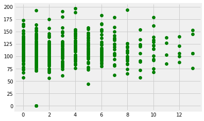
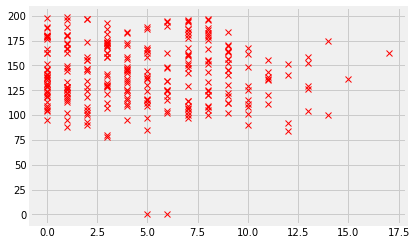
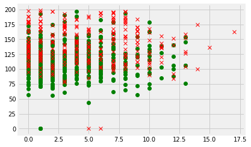
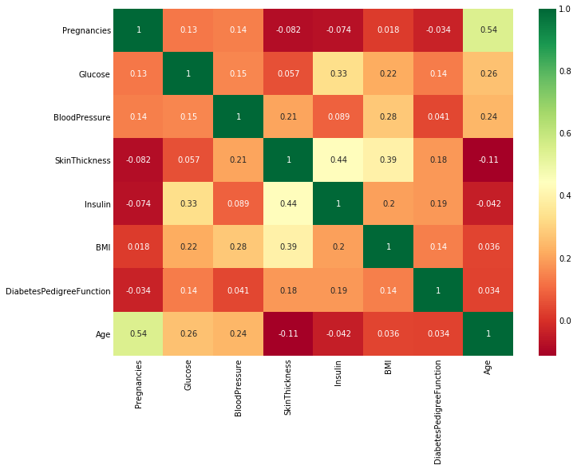

# Training Tutorial
In the following notebook, "Lost in Space" attempted to train a perceptron network on the incidence of diabetes among the Pima Indians. 
Most of the code in this notebook was taken from the textbook. However, we experimented with function parameters. All changes are explained above the altered cells.

## Dependencies
We adjusted some of the dependencies below in keeping with current standards. Pylab has fallen somewhat out of favor due to its packaging of several unneeded dependencies. We found that pylab can adversely effect the namespaces.
Also inlcuded here is the 'fivethirtyeight' plot style. I find the custom plots created by the developers at fivethirtyeight.com to be more attractive and easier to read.


```python
%matplotlib inline

import matplotlib.pyplot as plt
import numpy as np
import pcn
plt.style.use('fivethirtyeight')
```


```python
pima = np.loadtxt('pima-indians-diabetes.data', delimiter=',')
```


```python
indices0 = np.where(pima[:, 8] == 0)
indices1 = np.where(pima[:, 8] == 1)
```


```python
plt.plot(pima[indices0, 0], pima[indices0, 1], 'go');
```





```python
plt.plot(pima[indices1, 0], pima[indices1, 1], 'rx');
```





```python
plt.plot(pima[indices0, 0], pima[indices0, 1], 'go');
plt.plot(pima[indices1, 0], pima[indices1, 1], 'rx');
```





```python
# Perceptron training on original data
p = pcn.pcn(pima[:, :8], pima[:, 8:9])
p.pcntrain(pima[:, :8], pima[:, :8:9], 0.25, 10000)
p.confmat(pima[:, :8], pima[:, 8:9])
```

    [[469. 238.]
     [ 31.  30.]]
    0.6497395833333334


```python
# Various preprocessing steps
pima[np.where(pima[:, 0] > 8), 0] = 8

pima[np.where(pima[:, 7] <= 30), 7] = 1
pima[np.where((pima[:, 7] > 30) & (pima[:, 7] <= 40)), 7] = 2
pima[np.where((pima[:, 7] > 40) & (pima[:, 7] <= 50)), 7] = 3
pima[np.where((pima[:, 7] > 50) & (pima[:, 7] <= 60)), 7] = 4
pima[np.where(pima[:, 7] > 60), 7] = 5
```


```python
pima[:, :8] = pima[:, :8] - pima[:, :8].mean(axis=0)
pima[:, :8] = pima[:, :8] / pima[:, :8].var(axis=0)
```

## Correlation Matrix
Here we attempted to find variables that had strong correlations to try training on different variables while excluding others. Most of the stronger correlations seem to be self explanatory (number of pregnancies being a function of one's age).


```python
# Correlation Tests
import pandas as pd
import seaborn as sns

pima_correlation = pd.read_csv('pima-test.csv')

sns.heatmap(pima_correlation[pima_correlation.columns[:8]].corr(),annot=True,cmap='RdYlGn')
fig=plt.gcf()
fig.set_size_inches(10,8)
plt.show()
```





## Slicing the Training Data


```python
trainin = pima[::2, [8]]
testin = pima[1::2, [8]]
traintgt = pima[::2, 8:9]
testtgt = pima[1::2, 8:9]
```

## Training
For the training of preprocessed data, we attempted training over 1 to 1000000 epochs. The
marginal gains obtained by 1000000 epochs did not warrant the drastically increased training time. We found that 10000 epochs consistently yielded at least a .69 to .72 success rate.
<br>
One interesting finding is that when training on Age plus one or two others, the confusion matrix returned 1.0 for all epochs.


```python
# Perceptron training on the preprocessed data
for i in range(1, 10):
    p1 = pcn.pcn(trainin, traintgt)
    p1.pcntrain(trainin, traintgt, 0.25, 10000)
    p1.confmat(testin, testtgt)
```

    [[251.   0.]
     [  0. 133.]]
    1.0
    [[251.   0.]
     [  0. 133.]]
    1.0
    [[251.   0.]
     [  0. 133.]]
    1.0
    [[251.   0.]
     [  0. 133.]]
    1.0
    [[251.   0.]
     [  0. 133.]]
    1.0
    [[251.   0.]
     [  0. 133.]]
    1.0
    [[251.   0.]
     [  0. 133.]]
    1.0
    [[251.   0.]
     [  0. 133.]]
    1.0
    [[251.   0.]
     [  0. 133.]]
    1.0

